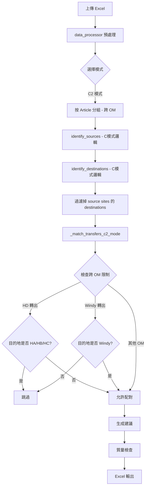

# C2 模式（跨OM重點補0）實作計劃

## 概述

新增 C2 模式，參照 C 模式（重點補0）邏輯，但解除不可跨 OM 的限制，允許跨 OM 配對。
系統將從八模式升級為**九模式系統**。

## C2 模式核心規則

### 轉出邏輯（與 C 模式完全相同）

| 項目 | 規則 |
|------|------|
| ND 店鋪 | 全數轉出（Priority 1） |
| RF 店鋪條件 | 庫存+在途 > Safety Stock，且不是最高銷量店 |
| 轉出比例上限 | 30% total_available |
| 轉出件數上限 | 最多 3 件 |
| 轉出最小值 | 至少 1 件 |
| 轉出類型 | RF過剩轉出（轉後>=Safety）/ RF加強轉出（轉後<Safety） |

### 接收邏輯（與 C 模式完全相同）

| 項目 | 規則 |
|------|------|
| 接收條件 | RF 店鋪，且 SaSa Net Stock + Pending Received <= 1 |
| 目標數量 | max(Safety Stock * 0.5, 3) |
| 需求數量 | 目標數量 - 總可用庫存 |
| 累計追蹤 | 追蹤累計接收數量，達到目標即停止 |

### 跨 OM 配對規則（C2 獨有）

| 項目 | 規則 |
|------|------|
| 分組方式 | 僅按 Article 分組（不按 OM），與 E/F/B3 模式相同 |
| HD 限制 | HD 店鋪不能轉到 HA/HB/HC 的店鋪 |
| Windy 限制 | Windy 的轉出只能到 Windy 的店鋪，但 Windy 店鋪可接收其他 OM |
| 同源限制 | 同一 SKU 的轉出店鋪不能同時接收 |

### 匹配優先級順序

```
1. ND轉出 → 重點補0
2. RF過剩轉出 → 重點補0
3. RF加強轉出 → 重點補0
```

> 與 C 模式不同，C2 不處理「緊急缺貨」和「潛在缺貨」，純粹聚焦重點補0 + 跨OM配對。
> 但也保留 C 模式原有的緊急缺貨與潛在缺貨匹配階段。

## 修改範圍

### 1. business_logic.py

#### 1.1 新增模式常量
- 在 `__init__` 中新增: `self.mode_c2 = "附加C2(跨OM重點補0)"`

#### 1.2 identify_sources 方法
- C2 模式走 C 模式的轉出邏輯（30%上限/3件上限/至少1件）
- 在 RF 類型轉出的 mode 判斷中，將 C2 歸類到 C 模式路徑

#### 1.3 identify_destinations 方法
- C2 模式走 C 模式的接收邏輯（total_available <= 1 的重點補0）
- 複用 C 模式的接收條件

#### 1.4 match_transfers 方法
- 新增 C2 模式路由到專用 `_match_transfers_c2_mode` 方法

#### 1.5 新增 _match_transfers_c2_mode 方法
- 參照 `_match_transfers_f_mode` 的跨 OM 邏輯框架
- 實現 HD 限制和 Windy 限制
- 匹配順序：
  1. ND轉出 → 重點補0
  2. ND轉出 → 緊急缺貨
  3. ND轉出 → 潛在缺貨
  4. RF過剩轉出 → 重點補0
  5. RF過剩轉出 → 緊急缺貨
  6. RF過剩轉出 → 潛在缺貨
  7. RF加強轉出 → 重點補0
  8. RF加強轉出 → 緊急缺貨
  9. RF加強轉出 → 潛在缺貨

#### 1.6 generate_transfer_recommendations 方法
- 模式驗證列表加入 `self.mode_c2`
- 跨 OM 模式列表加入 `self.mode_c2`（按 Article 分組）
- 在處理分支中加入 C2 模式路由

#### 1.7 _create_recommendation_note 方法
- 必要時新增 C2 模式的特殊說明

### 2. app.py

#### 2.1 頁面標題
- 更新版本號為 v2.3.0

#### 2.2 側邊欄系統資訊
- 更新「八模式系統」為「九模式系統」
- 新增 C2 模式功能描述

#### 2.3 模式選擇
- 在 radio 選項中新增: `"C2: 附加C(跨OM重點補0)"`
- 位置：放在 C 模式之後、D 模式之前

#### 2.4 模式說明
- 新增 C2 模式的詳細說明

#### 2.5 欄位提示
- C2 模式歸類到 A-D 模式的必需欄位組（不需要特殊欄位）

#### 2.6 模式名稱轉換
- 新增: `elif transfer_mode == "C2: 附加C(跨OM重點補0)": mode_name = "附加C2(跨OM重點補0)"`

### 3. excel_generator.py

#### 3.1 文檔字串
- 更新模組描述和類描述為「九模式系統」

### 4. README.md

- 系統概述：更新為九模式系統
- 功能特點：新增 C2 模式描述
- 模式對比表：新增 C2 列
- 使用說明：新增 C2 模式行
- 業務邏輯：新增 C2 模式轉出/接收規則

### 5. VERSION.md

- 新增 v2.3.0 版本記錄
- 詳述 C2 模式新增內容

### 6. 三種調貨模式詳解.txt

- 新增 C2 模式完整邏輯描述
- 更新對比表新增 C2 列
- 更新應用場景建議

## 架構流程圖



## C2 與 C 模式差異對比

| 特性 | C 模式 | C2 模式 |
|------|--------|---------|
| 轉出邏輯 | 30%/3件/至少1件 | 完全相同 |
| 接收邏輯 | 重點補0 | 完全相同 |
| 分組方式 | Article + OM | **僅 Article** |
| 跨 OM 配對 | ❌ 不允許 | ✅ 允許 |
| HD 限制 | N/A | HD 不能轉到 HA/HB/HC |
| Windy 限制 | N/A | Windy 轉出只到 Windy，可接收其他 OM |
| 模式名稱 | 重點補0 | 附加C2 - 跨OM重點補0 |
