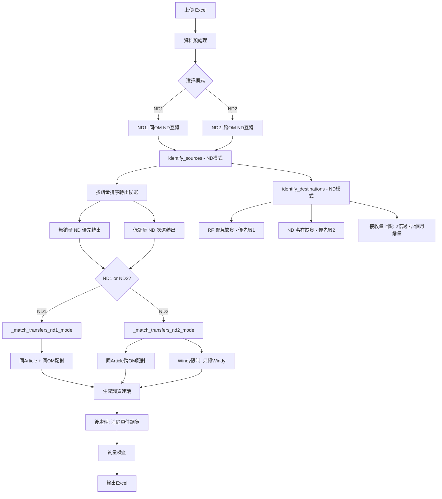

# ND1/ND2 模式實作計劃

## 1. 需求概述

新增兩個 ND 調貨模式，打破現有「ND 店舖不可接收」的全局規則，允許 ND 店舖之間互相調貨。

### ND1 模式（ND 同 OM 轉貨）
- ND Shop 可以轉去 ND Shop
- **限制同一個 OM 組別**及同一個 Article
- 分組方式：Article + OM（與 A/B/C 等模式相同）

### ND2 模式（ND 混合 OM 轉貨）
- ND Shop 可以轉去 ND Shop
- **無同組 OM 限制**（跨 OM 配對允許）
- **Windy 店舖不能轉去其他 OM**（與 B3/C2/E2 的 Windy 規則一致）
- 分組方式：僅按 Article（與 B3/C2/E2/F 模式相同）

---

## 2. 調貨算法設計

### 2.1 兩層優先級系統

```
優先級 1：RF 店舖緊急缺貨 → 優先被滿足
優先級 2：ND 店舖潛在缺貨 → 次要被滿足
```

### 2.2 轉出（Source）規則 — 基於銷量排序

| 轉出優先級 | 條件 | 說明 |
|-----------|------|------|
| 最高優先 | Last Month Sold Qty = 0 且 MTD Sold Qty = 0 | 無銷售記錄的 ND 店舖優先轉出 |
| 次選 | Last Month Sold Qty + MTD Sold Qty 最低 | 低銷量 ND 店舖次選轉出 |
| 最低優先 | Last Month Sold Qty + MTD Sold Qty 最高 | 高銷量 ND 店舖保護，不輕易轉出 |

**轉出候選條件：**
- RP Type = ND
- SaSa Net Stock > 0（有庫存可轉）
- 最高銷量 ND 店舖受保護，不作為轉出源（與現有 RF 最高動銷店保護邏輯一致）

**轉出數量：**
- ND 店舖全數轉出（與現有 ND 轉出邏輯一致，可轉出 = SaSa Net Stock）

### 2.3 接收（Destination）規則 — 基於銷量排序

| 接收優先級 | 類型 | 條件 | 說明 |
|-----------|------|------|------|
| 1 | RF 緊急缺貨 | SaSa Net Stock = 0 且 Effective Sold Qty > 0 | RF 零庫存但有銷售記錄 |
| 2 | ND 潛在缺貨 | ND 店舖，庫存低於需求 | ND 店舖可接收（本模式特殊） |

**ND 接收排序：**
- Last Month Sold Qty + MTD Sold Qty 最高記錄 → 優先接收
- 接收標記類型：`ND潛在缺貨接收`

### 2.4 需求量限制功能

**接收量上限公式：**
```
max_receive = 2 × (Last Month Sold Qty + MTD Sold Qty)
```

- 確保接收量不超過實際需求
- 接收量限制於店舖 2 個月總銷售量的 2 倍為上限
- 若 2 個月總銷售量 = 0，則該店舖不可接收（沒有銷售需求）
- 累計追蹤接收數量，防止超額接收

### 2.5 轉出與接收店舖限制

- 在同一 Article 的情況下，調出店舖不可以同時為接收店舖
- 與現有全局規則一致（檢查 `transfer_sites` 集合）

---

## 3. 系統架構變更

### 3.1 流程圖



### 3.2 與現有模式的差異對比

| 項目 | 現有模式 A-F | ND1 模式 | ND2 模式 |
|------|-------------|---------|---------|
| ND 可接收 | ❌ 絕對不可 | ✅ ND 可接收 ND | ✅ ND 可接收 ND |
| 分組方式 | Article + OM 或 Article | Article + OM | 僅 Article |
| 跨 OM 配對 | 視模式而定 | ❌ 不允許 | ✅ 允許 |
| Windy 限制 | 視模式而定 | N/A 同OM | ✅ Windy 只轉 Windy |
| 轉出排序 | ND優先級1 + RF優先級2 | 按銷量排序 | 按銷量排序 |
| 接收排序 | 緊急缺貨 + 潛在缺貨 | RF緊急 → ND按銷量 | RF緊急 → ND按銷量 |
| 接收上限 | Safety Stock 倍數 | 2倍過去2個月銷量 | 2倍過去2個月銷量 |
| 轉出類型 | ND轉出 / RF轉出 | ND轉出(按銷量) | ND轉出(按銷量) |
| 接收類型 | 緊急/潛在缺貨 | RF緊急缺貨 + ND潛在缺貨接收 | RF緊急缺貨 + ND潛在缺貨接收 |

---

## 4. 檔案變更清單

### 4.1 `business_logic.py` — 核心邏輯（最大變更）

#### 4.1.1 新增模式定義
```python
self.mode_nd1 = "ND同OM轉貨"      # ND1模式
self.mode_nd2 = "ND混合OM轉貨"    # ND2模式
```

#### 4.1.2 新增輔助方法
```python
def _is_nd_transfer_mode(self, mode: str) -> bool:
    return mode in (self.mode_nd1, self.mode_nd2)
```

#### 4.1.3 修改 `identify_sources()` — ND 模式轉出邏輯
- 新增 ND1/ND2 模式分支
- ND 店舖按銷量排序：無銷量優先，低銷量次選
- 保護最高銷量 ND 店舖（與 RF 最高動銷店保護一致）
- 轉出類型標記：`ND轉出(按銷量)`
- 轉出數量：全數 SaSa Net Stock

#### 4.1.4 修改 `identify_destinations()` — ND 模式接收邏輯
- 新增 ND1/ND2 模式分支
- 優先級 1：RF 緊急缺貨（SaSa Net Stock = 0 且有銷售記錄）
- 優先級 2：ND 潛在缺貨（ND 店舖按銷量高低排序接收）
- 接收上限：`2 × (Last Month Sold Qty + MTD Sold Qty)`
- 若過去2個月銷量為 0，不列為接收候選
- 接收類型標記：`RF緊急缺貨補貨`、`ND潛在缺貨接收`

#### 4.1.5 新增 `_match_transfers_nd1_mode()` — 同 OM 匹配
- 僅同 Article + 同 OM 配對
- ND 轉出 → RF 緊急缺貨（優先）
- ND 轉出 → ND 潛在缺貨接收（次選）
- 累計追蹤接收數量，不超過上限
- 嚴格避免轉出店同時接收

#### 4.1.6 新增 `_match_transfers_nd2_mode()` — 跨 OM 匹配
- 僅按 Article 分組，允許跨 OM
- Windy 來源只能轉到 Windy 店舖
- HD 來源不能轉到 HA/HB/HC（與現有跨OM模式一致）
- 其餘邏輯同 ND1

#### 4.1.7 修改 `generate_transfer_recommendations()`
- 新增 ND1/ND2 模式到驗證列表
- ND2 加入跨 OM 分組方式（僅按 Article）
- ND1 使用 Article + OM 分組
- 路由到對應的匹配函數

#### 4.1.8 修改 `perform_quality_checks()`
- 檢查 7（ND 不能接收）需增加例外：ND1/ND2 模式下允許 ND 接收
- 需在檢查時傳入當前模式資訊

#### 4.1.9 修改 `_create_recommendation_note()`
- 新增 ND1/ND2 模式相關的 Notes 說明

### 4.2 `app.py` — UI 介面

#### 4.2.1 模式選擇列表
新增兩個選項：
```python
"ND1: ND同OM轉貨",
"ND2: ND混合OM轉貨"
```

#### 4.2.2 模式描述
```python
"ND1: ND同OM轉貨": "ND店舖互轉(同OM)",
"ND2: ND混合OM轉貨": "ND店舖互轉(跨OM)"
```

#### 4.2.3 詳細模式說明
新增 ND1/ND2 的完整說明區塊

#### 4.2.4 mode_name_map
```python
"ND1": "ND同OM轉貨",
"ND2": "ND混合OM轉貨"
```

#### 4.2.5 版本號更新
v2.5.0 → v2.6.0

### 4.3 `data_processor.py` — 資料處理
- 無需重大變更，現有欄位結構已支持 ND 模式所需資料
- 版本字串更新

### 4.4 `excel_generator.py` — 報表輸出
- 無需變更，現有輸出格式已通用

### 4.5 文件更新
- `README.md`：新增 ND1/ND2 模式說明
- `調貨模式詳解.txt`：新增 ND1/ND2 完整規則說明
- `transfer_logic_ai_brief.md`：新增 ND1/ND2 簡報
- `VERSION.md`：新增版本紀錄

### 4.6 測試
- `tests/test_nd_modes.py`：ND1/ND2 模式單元測試

---

## 5. 實作細節

### 5.1 identify_sources — ND 模式轉出邏輯虛擬碼

```python
if self._is_nd_transfer_mode(mode):
    # 只處理 ND 店舖
    nd_stores = group_df[group_df['RP Type'] == 'ND']
    
    # 找出最高銷量 ND 店舖（保護）
    max_sold = nd_stores['Effective Sold Qty'].max()
    # 若所有 ND 銷量相同（含全為0），不保護
    if max_sold == 0 or all_same:
        max_sold = float('inf')
    
    for row in nd_stores:
        if net_stock <= 0:
            continue
        if effective_sold >= max_sold:
            continue  # 保護最高銷量店
        
        total_sales = last_month + mtd
        # 排序鍵：total_sales 升序（0銷量最優先轉出）
        sources.append({
            'source_type': 'ND轉出(按銷量)',
            'priority': 1,
            'sort_key': total_sales,  # 用於排序
            ...
        })
    
    # 按 total_sales 升序排序（0銷量排最前）
    sources.sort(key=lambda x: x['sort_key'])
    return sources
```

### 5.2 identify_destinations — ND 模式接收邏輯虛擬碼

```python
if self._is_nd_transfer_mode(mode):
    rf_stores = group_df[group_df['RP Type'] == 'RF']
    nd_stores = group_df[group_df['RP Type'] == 'ND']
    
    # 優先級1：RF 緊急缺貨
    for row in rf_stores:
        if net_stock == 0 and effective_sold > 0:
            destinations.append({
                'dest_type': 'RF緊急缺貨補貨',
                'priority': 1,
                'needed_qty': safety_stock,
                ...
            })
    
    # 優先級2：ND 潛在缺貨接收
    for row in nd_stores:
        total_sales = last_month + mtd
        if total_sales <= 0:
            continue  # 0銷量不接收
        
        max_receive = 2 * total_sales  # 2倍過去2個月銷量
        current_stock = net_stock + pending
        
        if current_stock >= max_receive:
            continue  # 已達上限
        
        needed_qty = max_receive - current_stock
        destinations.append({
            'dest_type': 'ND潛在缺貨接收',
            'priority': 2,
            'needed_qty': needed_qty,
            'max_receive_qty': max_receive,
            ...
        })
    
    # ND 接收按 total_sales 降序排序（高銷量優先接收）
    destinations.sort(key=lambda x: (x['priority'], -x.get('total_sales', 0)))
    return destinations
```

### 5.3 _match_transfers_nd1_mode — 同 OM 匹配虛擬碼

```python
def _match_transfers_nd1_mode(self, sources, destinations, article, om, product_desc, mode):
    # 同 OM 內配對（類似 _match_transfers_e1_mode 結構）
    
    transfer_sites = set(s['site'] for s in sources if s['transferable_qty'] > 0)
    received_qty_by_site = {}
    
    for source in temp_sources:
        same_om_dests = [d for d in temp_destinations if d['om'] == source['om']]
        
        for dest in same_om_dests:
            # 基本檢查
            if source['site'] == dest['site']: continue
            if dest['site'] in transfer_sites: continue
            
            # 計算轉移量（考慮接收上限）
            receive_key = f"{dest['site']}_{article}"
            current_received = received_qty_by_site.get(receive_key, 0)
            max_receive = dest.get('max_receive_qty', float('inf'))
            
            transfer_qty = min(
                source['transferable_qty'],
                dest['needed_qty'],
                max_receive - current_received
            )
            
            if transfer_qty <= 0: continue
            
            # 建立 recommendation
            ...
```

### 5.4 _match_transfers_nd2_mode — 跨 OM 匹配虛擬碼

```python
def _match_transfers_nd2_mode(self, sources, destinations, article, product_desc, mode):
    # 跨 OM 配對（類似 _match_transfers_c2_mode 結構）
    
    transfer_sites = set(s['site'] for s in sources if s['transferable_qty'] > 0)
    received_qty_by_site = {}
    
    for dest in temp_destinations:
        for source in temp_sources:
            # 基本檢查
            if source['site'] == dest['site']: continue
            if dest['site'] in transfer_sites: continue
            
            # Windy 限制：Windy 來源只轉 Windy
            if source.get('om') == 'Windy' and dest.get('om') != 'Windy':
                continue
            
            # HD 限制：HD 不能轉到 HA/HB/HC
            if source['site'].upper().startswith('HD'):
                if dest['site'].upper().startswith(('HA', 'HB', 'HC')):
                    continue
            
            # 計算轉移量（考慮接收上限）
            ...
```

### 5.5 quality_checks 修改

現有檢查 7 需要模式資訊：

```python
# 修改 perform_quality_checks 簽名：新增 mode 參數
def perform_quality_checks(self, df: pd.DataFrame, mode: str = None) -> bool:
    ...
    # 檢查7：ND 不能接收（ND1/ND2 模式例外）
    if not self._is_nd_transfer_mode(mode):
        # 原有邏輯
        ...
```

同步修改 `app.py` 中呼叫 `perform_quality_checks` 的地方，傳入 `mode_name` 參數。

---

## 6. 匹配優先級順序

### ND1/ND2 模式的匹配順序

```
1. ND轉出(按銷量)（0銷量）→ RF緊急缺貨       [最高優先]
2. ND轉出(按銷量)（低銷量）→ RF緊急缺貨
3. ND轉出(按銷量)（0銷量）→ ND潛在缺貨接收   [次要優先]
4. ND轉出(按銷量)（低銷量）→ ND潛在缺貨接收
```

---

## 7. 新增轉出/接收類型標記

### 轉出類型
- `ND轉出(按銷量)`：ND 模式下基於銷量排序的 ND 轉出

### 接收類型
- `RF緊急缺貨補貨`：沿用現有（零庫存但有銷售記錄的 RF 店舖）
- `ND潛在缺貨接收`：ND 模式特有（ND 店舖按銷量高低接收）

---

## 8. 風險與注意事項

1. **breaking change**：ND1/ND2 模式打破「ND 不可接收」的全局規則，需確保不影響其他 13 個模式
2. **quality_checks**：新增 mode 參數傳遞，需同步修改 `app.py` 呼叫端
3. **後處理**：`_optimize_single_piece_transfers` 需確認對 ND 接收的建議也能正確處理
4. **接收上限為 0**：若 ND 店舖過去2個月銷量 = 0，理論上不能接收 → 需確保 identify_destinations 已排除
5. **Windy 限制**：ND2 模式需特別處理，所有 HD 開頭的 Windy 店舖之間的跨 OM 轉貨邏輯
