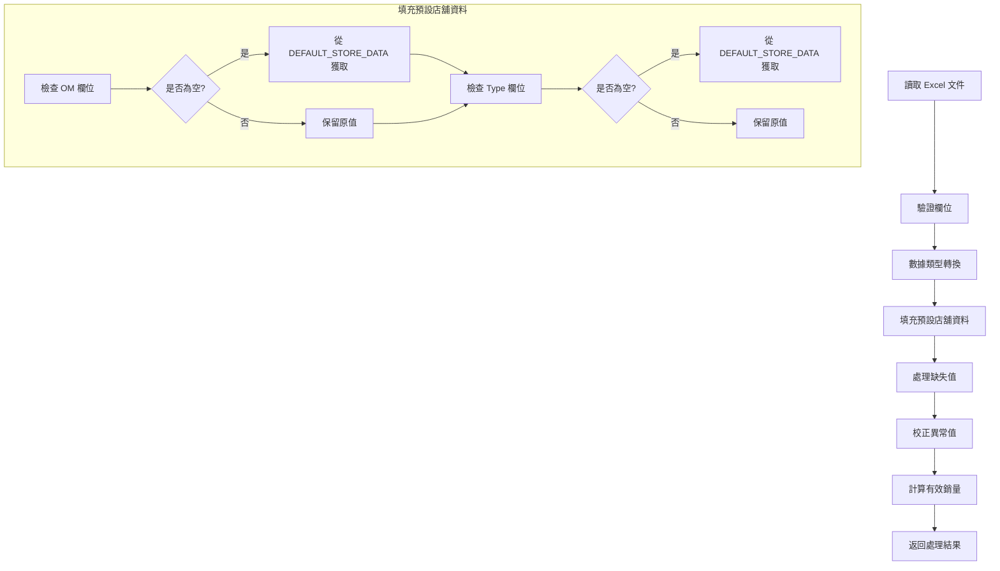

# 店舖預設資料整合計劃

## 1. 需求概述

將 `stores-template.csv` 的店舖資料直接寫入程式內，作為預設的 OM 和 Type 等資料來源。當用戶上傳的 Excel 沒有這些資料時，系統會自動使用預設值。

## 2. 資料結構分析

### stores-template.csv 欄位

| 欄位 | 說明 | 範例 |
|------|------|------|
| Site | 店舖編號 | HA02, HA06 |
| Shop | 店舖名稱 | 駱克, 北角 |
| Regional | 區域 | HK, MO |
| Class 1 | 等級1 | A, B, C, D |
| Class 2 | 等級2 | A1, A2, A3, B1, B2, C1, C2, D1 |
| Size | 店舖大小 | XS, S, M, L, XL |
| OM | 負責人 | Ivy, Violet, Queenie, Candy, Hippo, Eva, Windy |
| Type | 類型 | M, L, T |

### 資料統計

- 總店舖數：85 間
- HK 區域：77 間
- MO 區域：8 間
- OM 分佈：Ivy, Violet, Queenie, Candy, Hippo, Eva, Windy

## 3. 技術方案

### 3.1 資料結構設計

在 [`data_processor.py`](data_processor.py) 中新增一個字典常量：

```python
DEFAULT_STORE_DATA = {
    'HA02': {
        'shop': '駱克',
        'regional': 'HK',
        'class_1': 'B',
        'class_2': 'B2',
        'size': 'S',
        'om': 'Ivy',
        'type': 'M'
    },
    'HA06': {
        'shop': '北角',
        'regional': 'HK',
        'class_1': 'B',
        'class_2': 'B2',
        'size': 'M',
        'om': 'Ivy',
        'type': 'M'
    },
    # ... 其他店舖
}
```

### 3.2 新增函數

#### `get_store_default_info(site: str) -> Dict`

根據店舖編號查詢預設資料：

```python
def get_store_default_info(self, site: str) -> Dict:
    """
    根據店舖編號獲取預設資料
    
    Args:
        site: 店舖編號
        
    Returns:
        預設資料字典，如果找不到則返回空字典
    """
    return DEFAULT_STORE_DATA.get(site, {})
```

#### `fill_default_store_data(df: pd.DataFrame) -> pd.DataFrame`

自動填充缺失的店舖資料：

```python
def fill_default_store_data(self, df: pd.DataFrame) -> pd.DataFrame:
    """
    使用預設資料填充缺失的 OM 和 Type 欄位
    
    Args:
        df: 輸入 DataFrame
        
    Returns:
        填充後的 DataFrame
    """
    df_filled = df.copy()
    
    for idx, row in df_filled.iterrows():
        site = row['Site']
        default_info = self.get_store_default_info(site)
        
        # 填充 OM（如果缺失或為空）
        if pd.isna(row.get('OM')) or row.get('OM') == '':
            df_filled.at[idx, 'OM'] = default_info.get('om', '')
        
        # 填充 Type（如果缺失或為空）
        if pd.isna(row.get('Type')) or row.get('Type') == '':
            df_filled.at[idx, 'Type'] = default_info.get('type', '')
    
    return df_filled
```

### 3.3 整合流程

修改 [`preprocess_data()`](data_processor.py:282) 方法，在數據類型轉換後添加預設資料填充步驟：



## 4. 實施步驟

### 步驟 1：新增 DEFAULT_STORE_DATA 常量

在 [`data_processor.py`](data_processor.py) 頂部新增完整的店舖預設資料字典。

### 步驟 2：新增輔助函數

- `get_store_default_info(site)` - 查詢單一店舖資料
- `fill_default_store_data(df)` - 批量填充缺失資料

### 步驟 3：修改 preprocess_data() 方法

在數據類型轉換後、處理缺失值前，調用 `fill_default_store_data()` 方法。

### 步驟 4：更新版本號

將版本從 v2.1.1 升級到 v2.2.0（因為這是新功能）。

### 步驟 5：更新文檔

更新 README.md 和 VERSION.md 記錄此變更。

## 5. 使用場景

### 場景 1：用戶上傳的 Excel 有完整的 OM 和 Type 資料

系統使用用戶提供的資料，不進行覆蓋。

### 場景 2：用戶上傳的 Excel 缺少 OM 或 Type 資料

系統根據 Site 欄位自動從預設資料中填充對應的 OM 和 Type。

### 場景 3：用戶上傳的 Excel 有部分 OM 或 Type 資料

系統只填充缺失的欄位，已有資料不被覆蓋。

## 6. 優點

1. **快速讀取**：資料直接寫入程式內，無需每次讀取外部 CSV 文件
2. **自動填充**：用戶不需要手動輸入 OM 和 Type 資料
3. **向後兼容**：如果用戶有自己的資料，系統會優先使用
4. **易於維護**：資料集中在一個常量中，方便更新

## 7. 注意事項

1. 預設資料應定期更新以反映店舖資訊變更
2. 如果需要更新預設資料，需要修改程式碼並重新部署
3. 系統會記錄哪些資料是從預設值填充的（可在 Notes 欄位標註）

## 8. 測試計劃

1. 測試缺少 OM 欄位的 Excel 文件
2. 測試缺少 Type 欄位的 Excel 文件
3. 測試兩者都缺少的情況
4. 測試兩者都有的情況（不應被覆蓋）
5. 測試部分缺少的情況
6. 測試不存在的 Site（應返回空值）
