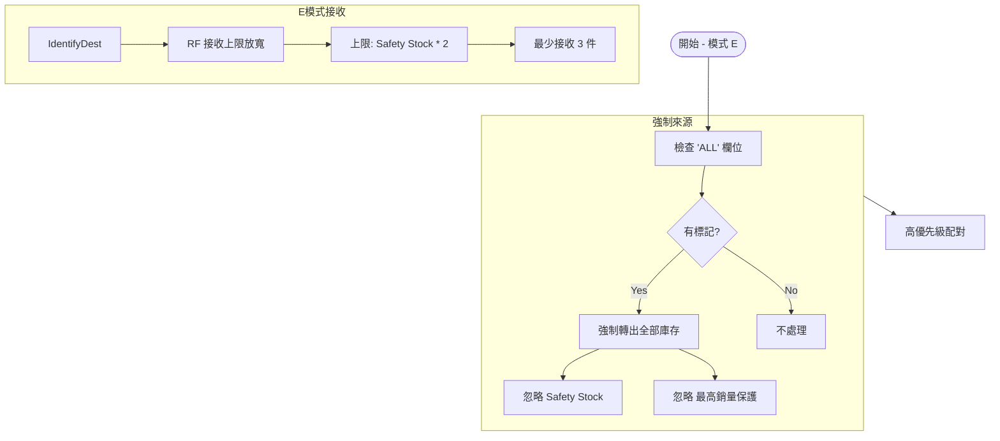

# KiLo 調貨系統邏輯圖解 (Transfer Logic Diagrams)

本文件提供 KiLo 系統五種主要調貨模式的邏輯可視化圖表，幫助理解不同模式下的店鋪篩選、數量計算與配對優先級。

## 1. 模式 A: 保守轉貨 (Conservative Mode)
此模式最為安全，僅調撥 **RF 店鋪的過剩庫存** (高於 Safety Stock 部分)，且設有 **20%** 的嚴格上限。

```mermaid
flowchart TD
    Start([開始 - 模式 A]) --> IdentifySources[1. 識別轉出來源]
    
    subgraph Source_Selection [來源篩選]
        IdentifySources --> CheckType{店鋪類型?}
        
        CheckType -- ND --> ND_Logic[ND 店鋪: 全部 Net Stock 可轉出]
        ND_Logic --> SetSrcType1[設定類型: ND轉出]
        SetSrcType1 --> Priority1[優先級: 1]
        
        CheckType -- RF --> RF_Check{庫存檢查}
        RF_Check --> CheckSafety{庫存 > Safety Stock?}
        CheckSafety -- No --> Skip_RF[不轉出]
        CheckSafety -- Yes --> CheckHighest{是否最高銷量店?}
        
        CheckHighest -- Yes --> Skip_RF2[保留 (不轉出)]
        CheckHighest -- No --> Calc_Qty[計算數量]
        
        Calc_Qty --> Logic_A[邏輯: Total - Safety]
        Logic_A --> Limit_A[上限: Max(Total * 20%, 2)]
        Limit_A --> Final_Qty[最終數量: Min(可轉, 上限)]
        Final_Qty --> Check_Pos{數量 > 0?}
        Check_Pos -- Yes --> SetSrcType2[設定類型: RF過剩轉出]
        SetSrcType2 --> Priority2[優先級: 2]
    end
    
    Priority1 & Priority2 --> IdentifyDest[2. 識別接收店鋪]
    
    subgraph Dest_Selection [接收篩選]
        IdentifyDest --> Filter_DF{店鋪類型?}
        Filter_DF -- ND --> Skip_Dest[ND 不可接收]
        Filter_DF -- RF --> Calc_Need[計算需求]
        
        Calc_Need --> Need_Formula[需求 = Safety Stock - Total Available]
        Need_Formula --> Check_Need{需求 > 0?}
        Check_Need -- No --> No_Need[無需求]
        Check_Need -- Yes --> Classify_Pri{缺貨程度}
        
        Classify_Pri -- "Total < 50% Safety" --> Dest_P1[急缺 (優先級 1)]
        Classify_Pri -- "Total < 100% Safety" --> Dest_P2[潛在 (優先級 2)]
    end
    
    Dest_P1 & Dest_P2 --> Match[3. 配對邏輯]
    
    subgraph Matching [配對順序]
        Match --> M1[1. ND轉出 -> 急缺]
        M1 --> M2[2. ND轉出 -> 潛在]
        M2 --> M3[3. RF過剩 -> 急缺]
        M3 --> M4[4. RF過剩 -> 潛在]
    end
    
    M4 --> End([結束])
```

---

## 2. 模式 B: 加強轉貨 (Enhanced Mode)
此模式較為進取，允許 **RF 店鋪** 釋放更多庫存 (最高 **50%**)，甚至在必要時略微低於 Safety Stock (稱為 RF加強轉出)。

```mermaid
flowchart TD
    Start([開始 - 模式 B]) --> IdentifySources[1. 識別轉出來源]
    
    subgraph Source_Selection_B [來源篩選 (加強)]
        IdentifySources --> CheckType{店鋪類型?}
        CheckType -- ND --> ND_Logic[ND 店鋪: 全部 Net Stock 可轉出]
        
        CheckType -- RF --> RF_Calc
        
        RF_Calc --> Logic_B[邏輯: 更深挖掘]
        Logic_B --> Base_B[基準 = Total - (Safety * 0.5)]
        Base_B --> Limit_B[上限: Max(Total * 50%, 2)]
        Limit_B --> Final_Qty[最終數量]
        
        Final_Qty --> Type_Check{剩餘庫存 >= Safety?}
        Type_Check -- Yes --> TypeBS[類型: RF過剩轉出]
        Type_Check -- No --> TypeBA[類型: RF加強轉出]
    end
    
    TypeBS & TypeBA & ND_Logic --> IdentifyDest
    
    subgraph Matching_B [配對順序 (更多層級)]
        IdentifyDest --> Match
        Match --> M1[1. ND轉出 -> 急缺]
        Match --> M2[2. ND轉出 -> 潛在]
        Match --> M3[3. RF過剩 -> 急缺]
        Match --> M4[4. RF過剩 -> 潛在]
        Match --> M5[5. RF加強 -> 急缺]
        Match --> M6[6. RF加強 -> 潛在]
    end
```

---

## 3. 模式 C: 重點補0 (Zero Stock Priority)
此模式專注於解決 **極低庫存 (<=1)** 的店鋪問題。RF 轉出量介於 A 與 B 之間 (**30% 或 Max 3件**)。

```mermaid
flowchart TD
    Start([開始 - 模式 C]) --> Dest_Focus[重點在接收端]
    
    subgraph Dest_Selection_C [接收篩選 (重點補0)]
        Dest_Focus --> Check_Stock{Total Available <= 1 ?}
        Check_Stock -- Yes --> Target_C[成為目標店鋪]
        Target_C --> Set_Need[目標補貨量: Max(Safety*0.5, 3)]
        Set_Need --> Dest_Type[類型: 重點補0]
    end
    
    subgraph Source_Selection_C [來源篩選 (微調)]
        RF_Source --> Calc_C[計算數量]
        Calc_C --> Limit_C[上限: Min(Total*30%, 3件)]
        Limit_C --> Note_C[特點: 小量多頻]
    end
    
    Source_Selection_C --> Match_C
    Dest_Selection_C --> Match_C
    
    Match_C --> Priority_C[優先配對: 任何轉出 -> 重點補0]
```

---

## 4. 模式 D: 清貨轉貨 (Clearance Mode)
此模式專門處理 **ND 店鋪** 的滯銷品 (Sales=0)，並包含特殊的 **防止餘 1 規則**。

```mermaid
flowchart TD
    Start([開始 - 模式 D]) --> Check_ND[只針對 ND 來源]
    
    subgraph ND_Clearance [ND 清貨邏輯]
        Check_ND --> Check_Sales{過去30天+MTD 銷量 = 0?}
        Check_Sales -- Yes --> Type_D[類型: ND清貨轉出]
        Check_Sales -- No --> Type_N[類型: ND轉出 (普通)]
    end
    
    subgraph Logic_No_One [防止餘 1 規則]
        Type_D --> Calc_Rem{計算轉後餘額}
        Calc_Rem -- 餘 1 --> Force_All[強制全轉 (餘0)]
        Calc_Rem -- 其他 --> Normal[正常轉出]
    end
    
    Normal & Force_All --> Match_D[配對至 RF 店鋪]
```

---

## 5. 模式 E: 強制轉出 (Force Transfer)
此模式由 Excel 內的 **ALL** 欄位觸發，完全忽略安全庫存規則，強制清空指定店鋪。


